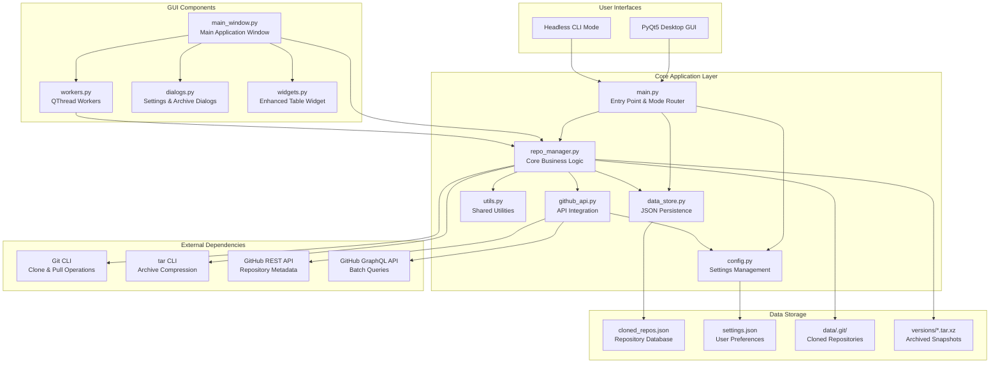
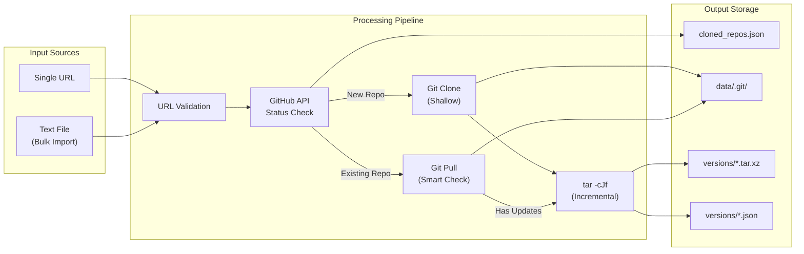
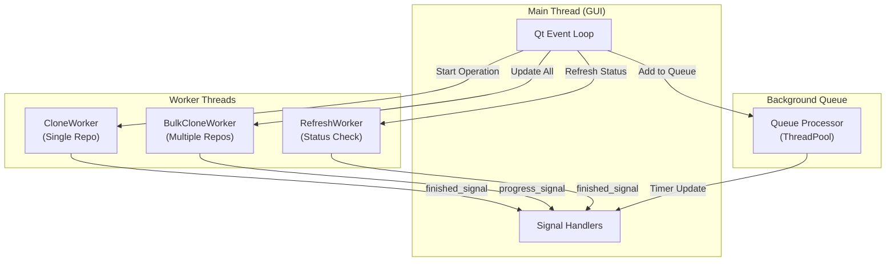

# Git-Archiver Architecture

## System Overview



## Data Flow Architecture



## Component Responsibilities

### Entry Points
- **`run.py`**: Convenience launcher script that imports and calls main()
- **`main.py`**: Parses command-line arguments, routes between GUI and CLI modes

### Core Modules
- **`repo_manager.py`**: The heart of the application. I placed all repository operations here including cloning, pulling, archiving, and status detection. It contains thread-safe JSON operations and API caching to ensure data integrity during concurrent operations.
- **`data_store.py`**: I designed this module to manage JSON persistence with robust error recovery. It can rebuild corrupted JSON files by extracting valid entries using regex parsing.
- **`github_api.py`**: Handles GitHub API interactions with rate limiting, retries, and token authentication. I implemented automatic backoff when approaching rate limits.
- **`config.py`**: Centralized configuration management including file paths, default settings, and token storage.

### GUI Layer
- **`main_window.py`**: Main application window with table view, search/filter, and queue management
- **`workers.py`**: QThread-based workers that run clone/update operations without blocking the UI
- **`dialogs.py`**: Modal dialogs for settings configuration and archive browsing
- **`widgets.py`**: Enhanced table widget with custom styling

## Key Architecture Decisions

### 1. Shallow Clones for Initial Download
I chose to use `git clone --depth 1` for initial repository downloads. This provides 5-10x faster clone times compared to full history clones. Since the primary goal is archiving current state (not historical analysis), shallow clones make sense. The trade-off is that the local copy lacks full git history, but for archiving purposes this is acceptable.

### 2. Incremental Archives with MD5 Hashing
Rather than creating full archives on every update, I implemented an incremental archive system. Each archive stores MD5 hashes of all files in a companion `.json` metadata file. On subsequent updates, only files with changed hashes are included. This achieves 70-90% space savings for repositories with frequent small updates.

### 3. GraphQL Batching for Status Checks
The GitHub REST API limits you to one repository per request. I implemented GraphQL batch queries that can check up to 100 repositories in a single API call. This dramatically reduces API usage when refreshing status for a large collection of tracked repositories.

### 4. Atomic JSON Writes with Recovery
JSON file corruption was a real risk during development (power loss, crashes). I implemented atomic writes (write to temp file, then rename) and a recovery system that can extract valid repository entries from corrupted JSON using regex parsing. This approach has saved data multiple times during development.

### 5. QThread Workers for UI Responsiveness
Long-running operations (clone, pull, archive) run in QThread workers to keep the GUI responsive. Workers communicate with the main thread via Qt signals, allowing safe UI updates without blocking. I chose QThread over Python's threading module for better Qt integration.

### 6. Dual-Mode Architecture (GUI + CLI)
I designed the application to support both interactive GUI usage and headless CLI mode for automation. The CLI mode is ideal for cron jobs or scheduled tasks that update repositories automatically without human interaction. Both modes share the same core logic.

### 7. 5-Minute API Cache
To reduce redundant GitHub API calls, I implemented a 5-minute TTL cache. When checking multiple repositories in quick succession, cached results are reused. This is particularly valuable during bulk operations and helps stay under rate limits.

## Threading Model



## File System Structure

```
Git-Archiver/
├── src/                          # Source code
│   ├── __init__.py
│   ├── __main__.py               # Module entry point
│   ├── main.py                   # Application entry
│   ├── cli.py                    # Headless mode
│   ├── config.py                 # Configuration
│   ├── utils.py                  # Utilities
│   ├── data_store.py             # JSON persistence
│   ├── github_api.py             # GitHub API
│   ├── repo_manager.py           # Core logic (~1100 lines)
│   └── gui/
│       ├── __init__.py
│       ├── main_window.py        # Main window (~720 lines)
│       ├── workers.py            # Background threads
│       ├── dialogs.py            # Modal dialogs
│       └── widgets.py            # Custom widgets
├── scripts/                      # Utility scripts
│   ├── sync_repos.py             # JSON/disk synchronization
│   ├── repair_json.py            # JSON recovery
│   └── create_fresh_json.py      # Fresh database creation
├── tests/
│   ├── test_config.py            # Config and settings tests
│   ├── test_data_store.py        # JSON persistence tests
│   ├── test_github_api.py        # GitHub API tests
│   ├── test_repo_manager.py      # Core operations tests
│   └── test_utils.py             # Utility function tests
├── data/                         # Repository storage
│   └── <repo-name>.git/
│       └── versions/
│           ├── 20250114-120000.tar.xz
│           └── 20250114-120000.json
├── cloned_repos.json             # Repository database
└── settings.json                 # User settings
```

## Legacy Code

The codebase was refactored from a monolithic architecture (v1.x) into the current modular structure (v2.0.0). Three legacy files remain in `src/` for reference but are not actively used:

| File | Lines | Replaced By |
|------|-------|-------------|
| `github_repo_saver_gui.py` | 2,064 | `src/gui/` package |
| `github_repo_saver_cli.py` | 351 | `src/cli.py` |
| `github_repo_saver_web.py` | 619 | Not actively maintained |

## Limitations

- **No Git History**: Shallow clones mean I cannot access historical commits. If full history is needed, the archive would need to be modified.
- **GitHub Only**: The current implementation is GitHub-specific. Supporting GitLab or Bitbucket would require API adapter pattern refactoring.
- **Single Machine**: No distributed architecture - everything runs locally. For massive collections, a distributed approach would be needed.
- **No Deduplication**: Archives may contain duplicate content across versions. A content-addressable storage system could reduce this.
