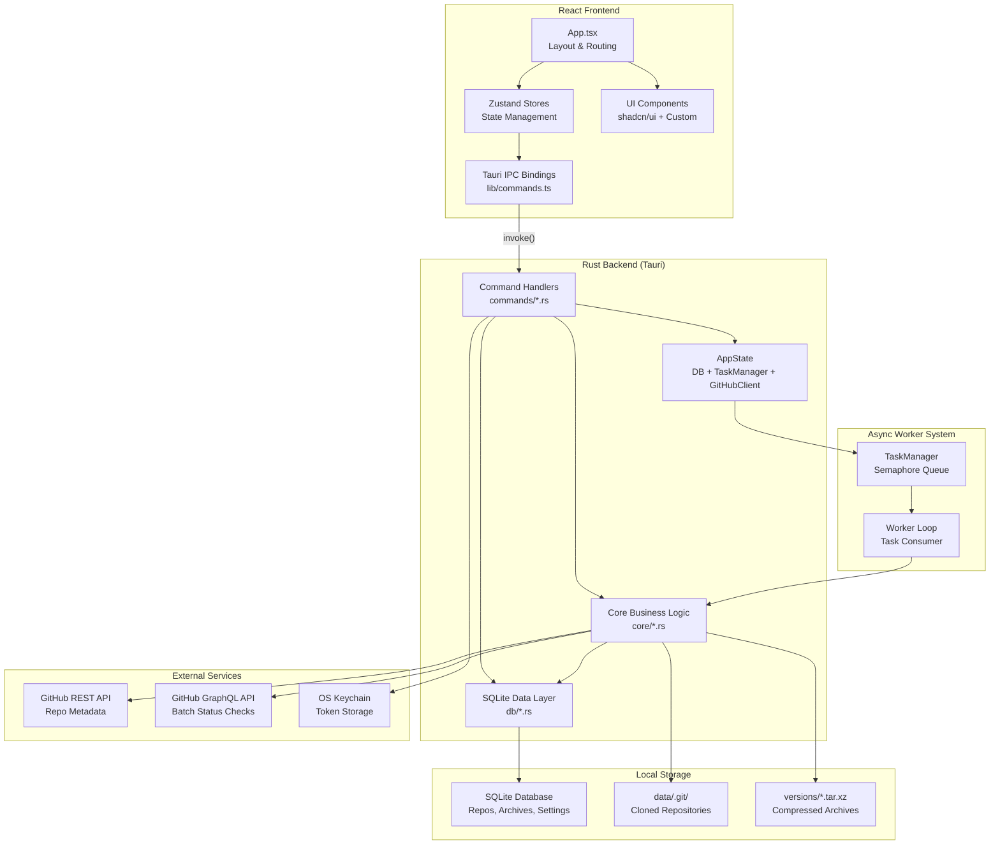
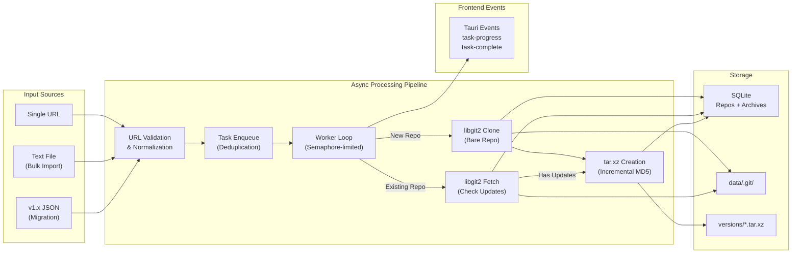
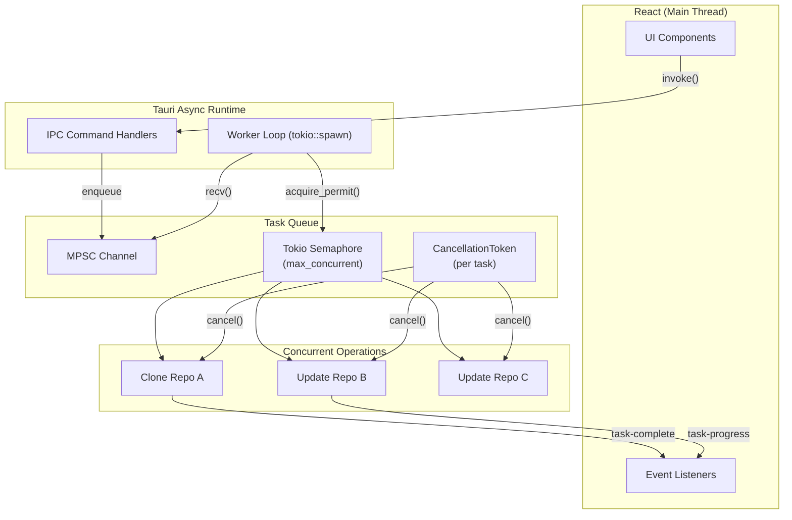

# Git Archiver Architecture

## System Overview



## Data Flow Architecture



## Component Responsibilities

### Rust Backend

#### Command Handlers (`commands/`)
- **`repos.rs`**: Add, list, delete repositories. Bulk import from text files with URL validation.
- **`tasks.rs`**: Enqueue clone/update tasks via TaskManager. Update-all triggers batch processing. Stop-all cancels in-flight tasks.
- **`archives.rs`**: List archives for a repository, extract archives to a target directory, delete individual archives.
- **`settings.rs`**: Load/save app settings (data directory, concurrency). Manage GitHub token via OS keychain. Check API rate limits.
- **`migrate.rs`**: Parse v1.x `cloned_repos.json` format, import repositories, scan for existing archives on disk.

#### Core Business Logic (`core/`)
- **`git.rs`**: Clone and fetch operations using libgit2. Bare repository support with credential callbacks for authenticated access.
- **`github_api.rs`**: REST API for individual repo info. GraphQL batch queries for up to 100 repos per request. Rate limit checking. Input sanitization against GraphQL injection.
- **`archive.rs`**: Create/extract `.tar.xz` archives. Incremental archives using file hash comparison. Tar-slip path traversal protection on extraction.
- **`hasher.rs`**: MD5 directory hashing for incremental archive detection. Excludes `.git/` directories.
- **`task_manager.rs`**: MPSC channel-based task queue with tokio semaphore for concurrency control. Per-task cancellation tokens. Deduplication prevents duplicate clone/update operations.
- **`worker.rs`**: Long-running async loop that consumes tasks from the channel. Acquires semaphore permits, executes operations, emits Tauri events for frontend progress updates.
- **`url.rs`**: GitHub URL validation, normalization (lowercase, strip trailing slash/`.git`), and owner/repo extraction. Rejects percent-encoded path traversal attempts.

#### Database Layer (`db/`)
- **`migrations.rs`**: Schema versioning with incremental migrations. Creates repos, archives, file_hashes, and settings tables.
- **`repos.rs`**: CRUD operations for repositories with status filtering and metadata updates.
- **`archives.rs`**: Archive record management with cascade delete when repos are removed.
- **`file_hashes.rs`**: Per-repo file hash storage for incremental archive diffing.
- **`settings.rs`**: Key-value settings with allowlist validation.

### React Frontend

#### State Management (`stores/`)
- **Zustand stores**: Centralized state for repositories, archives, settings, and UI preferences. Async actions call Tauri IPC commands.

#### Key Components
- **`repo-table/`**: TanStack Table-based repository list with column sorting, status filtering, row selection, and context menu actions.
- **`add-repo-bar.tsx`**: URL input with single-add and bulk import (file picker) support.
- **`activity-log.tsx`**: Scrollable log that listens to Tauri events for real-time operation feedback.
- **`status-bar.tsx`**: Displays active task count and GitHub API rate limit status.
- **`dialogs/`**: Settings dialog (data directory, concurrency, GitHub token), archive viewer, and migration wizard.

## Key Architecture Decisions

### 1. Rust/Tauri Rewrite (v2.0.0)
The original Python/PyQt5 application was rewritten in Rust with a Tauri v2 shell and React frontend. This provides native performance, cross-platform binaries (~5-7MB), built-in auto-updater, and OS keychain integration. The trade-off was increased development complexity, but the result is a significantly more robust and distributable application.

### 2. SQLite over JSON
The v1.x app used a JSON file as its database, which was prone to corruption and required manual recovery tools. SQLite provides ACID transactions, proper schema migrations, cascade deletes, and concurrent-safe access without any of those issues.

### 3. libgit2 over Git CLI
Using `git2` (Rust bindings for libgit2) instead of shelling out to `git` CLI eliminates the external dependency, provides better error handling, and enables credential callbacks for token-based authentication without environment variable manipulation.

### 4. Async Task Queue with Semaphore
Rather than spawning unbounded threads, the worker system uses a tokio semaphore to limit concurrent operations (configurable 1-10). Tasks flow through an MPSC channel with deduplication, and each task gets a cancellation token for graceful stop-all support.

### 5. Incremental Archives with MD5 Hashing
Carried over from v1.x — each archive stores MD5 hashes of all files in the database. Subsequent archives only include changed files, achieving 70-90% space savings for frequently updated repositories.

### 6. OS Keychain for Token Storage
GitHub tokens are stored in the OS keychain (macOS Keychain, Windows Credential Manager, Linux Secret Service) via the `keyring` crate, rather than in a plaintext config file. This is both more secure and follows platform conventions.

## Concurrency Model



## Database Schema

```
repos: id, url, owner, name, status, description, is_private, local_path, last_cloned, last_updated, created_at
archives: id, repo_id (FK), file_path, file_size, file_count, archive_type, created_at
file_hashes: id, repo_id (FK), file_path, hash, updated_at
settings: key, value
```
